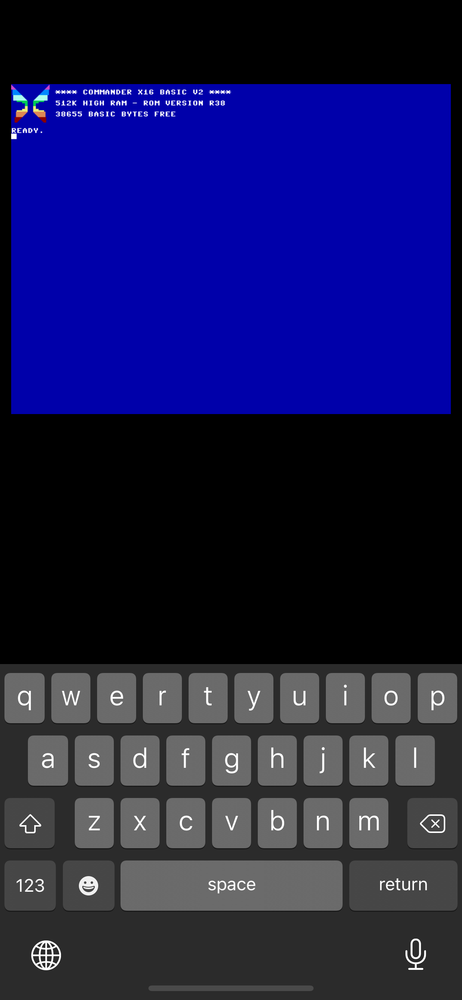

iOS Version
--------
*This is a fork to work on the iOS version. Its's currently a quick and dirty implementation (work in progress).*

iOS Version is writen February 2021 by Roger Boesch.

iOS Features
--------

* Load and start with default rom
* Support of virtual keyboard

*Under development:*

* Audio Support
* SD card support
* Copy/paste support
* iCloud access

#### Screenshot

