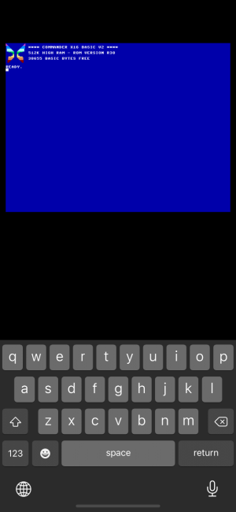

iOS Version
--------
*This is a fork to work on the iOS version. Its's currently a quick and dirty implementation (work in progress).*

iOS Version is writen February 2021 by Roger Boesch.

iOS Features
--------

* Load and start with default rom
* Support of virtual keyboard
* iCloud access: Type *LOAD "@"* to open the iCloud Drive and load the file

*Under development:*

* Audio Support
* SD card support
* Copy/paste support
* Debugger support

#### Screenshot

